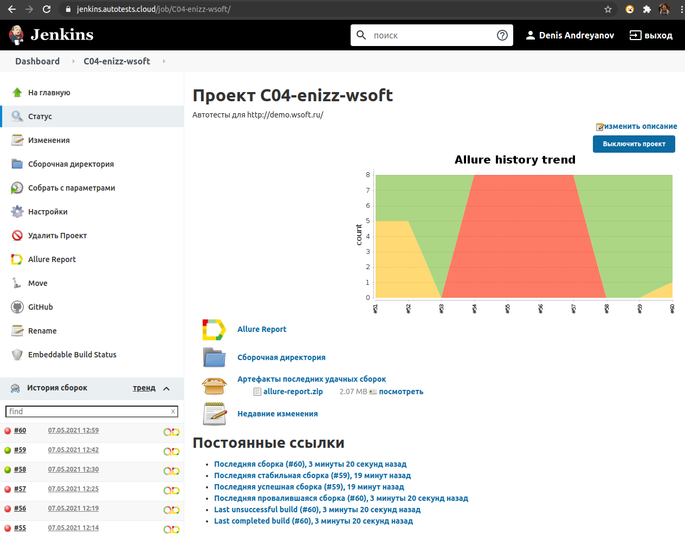
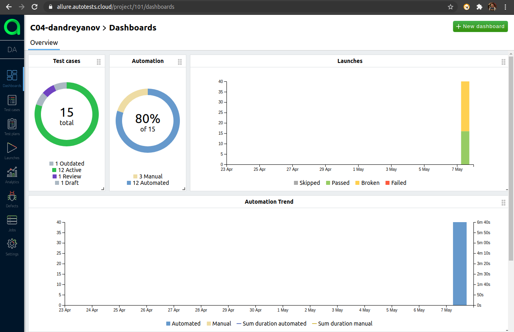

  

# Автотесты личного кабинета http://demo.wsoft.ru/
## Реализованы проверки страницы "Личные данные"
- [X] - Успешное заполнение всех полей
- [X] - Попытка сохранить значения с неправильным подтверждением пароля
- [X] - Попытка сохранить данные без заполненного поля ФИО
- [X] - Попытка сохранить данные без заполненного поля номер телефона
- [X] - Попытка сохранить данные без заполненного поля подтверждение пароля

## Реализованы проверки API
- [X] - Авторизация через LK-API
- [X] - Проверка метода Get profile data
- [X] - Проверка метода Put profile data

## Запуск в Jenkins

## Управление тестами в AllureTestOps

## Добавлено видео о прохождении тестов

## Добавлен отчёт Allure

## Добавлено уведомление в Telegram

